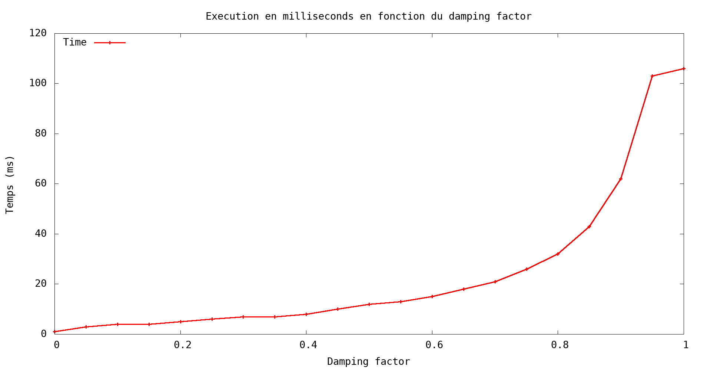

# pageRank

Implémentation de l'algorithme de page Rank amélioré avec la méthode de la puissance.



----
### Script

```
bash ./script/script.sh
```
Ce script exécute la compilation, l'exécution de l'exécutable et la création des courbes.

---
### Compilation

```
make
```
---
### Executable

```
./pageRank
```
### Plot

```
gnuplot -c ./script/gnuplot.gp data/"..." > ./plot/plot_"...".png
```
